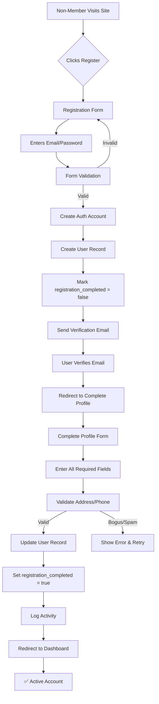
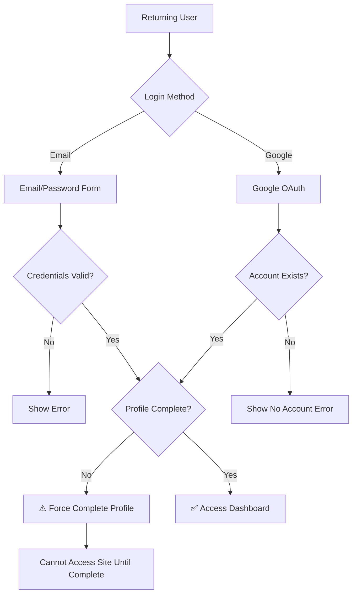

# Car Audio Events Registration Flow Diagram

## User Registration & Authentication Flows

### Flow 1: Email Registration (Traditional)


### Flow 2: Google Sign-In (OAuth)
```mermaid
graph TD
    A[Non-Member Visits Site] --> B{Clicks Google Sign-In}
    B --> C[Google OAuth Flow]
    C --> D{User Exists?}
    D -->|No| E[Block Sign-In]
    E --> F[Show "No Account" Error]
    F --> G[Suggest Email Registration]
    D -->|Yes| H{Profile Complete?}
    H -->|No| I[Force Complete Profile]
    I --> J[Complete Profile Form]
    J --> K[Enter All Required Fields]
    K --> L[Validate Address/Phone]
    L -->|Valid| M[Update User Record]
    L -->|Bogus/Spam| N[Show Error & Retry]
    M --> O[Set registration_completed = true]
    O --> P[Log Activity]
    P --> Q[Redirect to Dashboard]
    H -->|Yes| Q
    Q --> R[✅ Active Account]
```

### Flow 3: Returning User Login


## Key Security & Validation Points

### 1. Registration Gatekeeping
- **Email Registration**: Account created but marked incomplete
- **Google Sign-In**: BLOCKED if no existing account
- **Profile Completion**: MANDATORY before site access

### 2. Profile Validation Rules
```
✅ VALID Examples:
- Real addresses with apartment/suite numbers
- PO Boxes for business accounts
- International formats

❌ REJECTED Patterns:
- "123 Main Street" (too generic)
- "123 Fake Street"
- "111 Test Ave"
- "1234 ABCD Street"
- Single letters/numbers only
- Profanity in addresses
- Obviously fake cities ("Faketown", "Testville")
- Repeated characters ("aaaa bbbb")
```

### 3. Phone Validation
```
✅ VALID:
- (555) 123-4567 (but not all same digits)
- +1-555-123-4567
- International formats

❌ REJECTED:
- (000) 000-0000
- (111) 111-1111
- (123) 456-7890
- (555) 555-5555
```

### 4. Name Validation
```
✅ VALID:
- Real names with accents/special chars
- Hyphenated names
- Names with apostrophes (O'Brien)

❌ REJECTED:
- "Test User"
- "John Doe" 
- "asdf asdf"
- Single letters
- Numbers in names
- Profanity
```

## Database State During Registration

### After Initial Registration (Email or Google)
```sql
users table:
- id: [UUID]
- email: user@example.com
- name: "From Google" or "From Registration"
- registration_provider: 'email' or 'google'
- registration_completed: FALSE ⚠️
- first_name: NULL
- last_name: NULL
- phone: NULL
- address: NULL
- city: NULL
- state: NULL
- zip: NULL
- country: NULL
```

### After Profile Completion
```sql
users table:
- registration_completed: TRUE ✅
- first_name: "John"
- last_name: "Smith"
- phone: "(555) 123-4567"
- address: "456 Oak Street, Apt 2B"
- city: "Austin"
- state: "TX"
- zip: "78701"
- country: "US"
```

## Activity Logging Points
1. **Registration Started**: When account created
2. **Email Verified**: When user clicks verification link
3. **Profile Completed**: When all fields validated and saved
4. **Login Attempts**: Both successful and failed
5. **Profile Updates**: Any changes after completion

## Anti-Spam Implementation Strategy

### Phase 1: Basic Pattern Detection
- Reject known fake addresses
- Block sequential/repeated numbers
- Detect test data patterns

### Phase 2: Advanced Validation
- Check against known spam databases
- Verify postal codes match cities
- Phone number format validation by country

### Phase 3: Behavioral Analysis
- Track registration velocity from IP
- Detect automated form filling
- Monitor for suspicious patterns

## Error Messages for Users

### Bogus Address Detected:
"Please enter a valid street address. Generic or test addresses are not accepted."

### Invalid Phone Number:
"Please enter a valid phone number. Test numbers are not accepted."

### Incomplete Profile (Google Users):
"Welcome back! Please complete your profile to access your account."

### No Account (Google Sign-In):
"No account found. Please register using the sign-up form first."