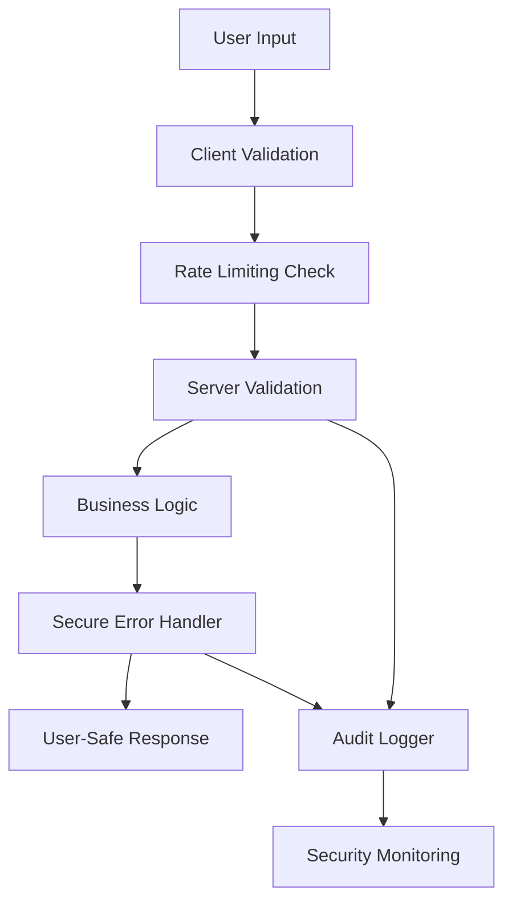

# Input Validation and Secure Error Handling Framework

## Overview

This comprehensive framework provides robust input validation, rate limiting, and secure error handling for the Car Audio Events platform. It prevents common security vulnerabilities while maintaining excellent user experience through clear, actionable error messages.

## Architecture



## Core Components

### 1. Input Validation Framework (`src/utils/input-validation.ts`)

**Purpose**: Comprehensive Zod-based validation with sanitization and rate limiting integration.

**Key Features**:
- ✅ **Zod Schemas**: Type-safe validation for all input types
- ✅ **Rate Limiting**: Integrated protection against abuse  
- ✅ **Sanitization**: XSS and injection prevention
- ✅ **Specialized Validators**: Domain-specific validation functions

**Usage Example**:
```typescript
import { ValidationSchemas, Validators } from '@/utils/input-validation';

// Validate email
const emailResult = await Validators.input('user@example.com', ValidationSchemas.email);

// Validate payment data
const paymentResult = await Validators.payment({
  amount: 2500,
  currency: 'usd',
  email: 'admin@caraudioevents.com'
});

// Validate user registration
const registrationResult = await Validators.registration({
  firstName: 'John',
  lastName: 'Doe',
  email: 'admin@caraudioevents.com',
  password: 'SecurePass123!',
  acceptTerms: true
});
```

### 2. Secure Error Handler (`src/utils/secure-error-handler.ts`)

**Purpose**: Sanitizes error messages to prevent information disclosure while maintaining audit trails.

**Key Features**:
- ✅ **Error Code Mapping**: Internal codes to user-friendly messages
- ✅ **Information Sanitization**: Removes sensitive data from client responses
- ✅ **Audit Logging**: Complete error tracking for security analysis
- ✅ **Context Preservation**: Maintains debugging information internally

**Usage Example**:
```typescript
import { handleError, handlePaymentError, createErrorResponse } from '@/utils/secure-error-handler';

// Handle generic error
const secureError = handleError(
  new Error('Database connection failed'),
  { userId: '123', endpoint: '/api/users' },
  'DATABASE_CONNECTION_FAILED'
);

// Handle payment error with special care
const paymentError = handlePaymentError(
  'Card declined by issuer',
  {
    paymentIntentId: 'pi_1234567890',
    amount: 2500,
    currency: 'usd',
    provider: 'stripe'
  },
  { userId: '123', endpoint: '/api/payments' }
);

// Create API response
const response = createErrorResponse(secureError);
```

### 3. Edge Function Validation (`supabase/functions/_shared/validation-middleware.ts`)

**Purpose**: Server-side validation middleware for Supabase Edge Functions with enhanced security.

**Key Features**:
- ✅ **Request Validation**: Comprehensive server-side input validation
- ✅ **Rate Limiting**: Database-backed rate limiting with IP tracking
- ✅ **Authentication**: JWT token validation and user extraction
- ✅ **CORS Protection**: Origin validation and secure headers

**Usage Example**:
```typescript
import { validatePaymentRequest, createErrorResponse, createSuccessResponse } from '../_shared/validation-middleware.ts';

// In an edge function
const validation = await validatePaymentRequest(request);

if (!validation.success) {
  return createErrorResponse(validation);
}

const paymentData = validation.data!;
// Process payment...

return createSuccessResponse({ 
  paymentId: 'pi_123',
  status: 'succeeded'
});
```

### 4. API Middleware (`src/middleware/api-validation-middleware.ts`)

**Purpose**: Validation middleware for Next.js API routes with comprehensive security features.

**Key Features**:
- ✅ **Method Validation**: Ensure only allowed HTTP methods
- ✅ **Origin Checking**: Validate request origins against whitelist
- ✅ **Authentication**: JWT validation with user context extraction
- ✅ **Request Size Limits**: Prevent payload-based attacks

**Usage Example**:
```typescript
import { validateContactForm, createApiErrorResponse, createApiSuccessResponse } from '@/middleware/api-validation-middleware';

export async function POST(request: NextRequest) {
  const validation = await validateContactForm(request);
  
  if (!validation.success) {
    return createApiErrorResponse(validation);
  }
  
  const contactData = validation.data!;
  // Process contact form...
  
  return createApiSuccessResponse({ messageId: 'msg_123' });
}
```

## Validation Schemas

### Basic Types

| Schema | Purpose | Example |
|--------|---------|---------|
| `emailSchema` | Email validation | `admin@caraudioevents.com` |
| `phoneSchema` | Phone number validation | `+1-234-567-8900` |
| `nameSchema` | Human name validation | `John Smith` |
| `passwordSchema` | Secure password validation | `SecurePass123!` |
| `urlSchema` | URL validation | `https://example.com` |

### Complex Forms

| Schema | Purpose | Fields |
|--------|---------|--------|
| `userRegistrationSchema` | User signup | firstName, lastName, email, password, phone |
| `contactFormSchema` | Contact form | name, email, subject, message, category |
| `paymentSchema` | Payment processing | amount, currency, paymentMethodId, email |
| `eventCreationSchema` | Event creation | title, description, startDate, location, etc. |

### Custom Validation

```typescript
import { z } from 'zod';
import { validateInput } from '@/utils/input-validation';

const customSchema = z.object({
  eventId: z.string().uuid(),
  participantCount: z.number().int().min(1).max(500),
  categories: z.array(z.string()).max(5),
});

const result = await validateInput(data, customSchema, {
  enableRateLimit: true,
  sanitizeOutput: true,
});
```

## Error Handling Strategy

### Error Classification

| Level | Description | Action | Example |
|-------|-------------|--------|---------|
| **Client** | Input validation errors | Show specific field errors | "Email format is invalid" |
| **Server** | Business logic errors | Show user-friendly message | "Payment could not be processed" |
| **System** | Infrastructure errors | Show generic message | "Service temporarily unavailable" |
| **Security** | Attack attempts | Log and block | "Too many requests" |

### Error Response Format

```typescript
// Success Response
{
  "success": true,
  "data": { /* actual data */ },
  "timestamp": "2025-01-15T10:30:00Z"
}

// Error Response
{
  "success": false,
  "error": {
    "code": "VAL_001",
    "message": "Please correct the following errors",
    "details": {
      "errorId": "ERR_1234567890_abc123",
      "validationErrors": ["Email format is invalid"],
      "retryable": true
    }
  }
}
```

## Security Features

### Input Sanitization

```typescript
// Automatic sanitization in validation schemas
const sanitizedData = await validateInput(userInput, schema, {
  sanitizeOutput: true  // Removes XSS and injection attempts
});
```

### Rate Limiting

```typescript
// Different rate limits for different operations
const rateLimitConfigs = {
  login: { maxAttempts: 5, windowMs: 15 * 60 * 1000 },      // 5 attempts per 15 min
  register: { maxAttempts: 3, windowMs: 60 * 60 * 1000 },   // 3 attempts per hour
  payment: { maxAttempts: 10, windowMs: 60 * 1000 },        // 10 attempts per minute
};
```

### Error Information Sanitization

```typescript
// Dangerous patterns automatically removed from error messages
const dangerousPatterns = [
  /database|sql|postgres/gi,     // Database information
  /[a-z0-9]{20,}/gi,            // Potential tokens
  /\b(?:\d{1,3}\.){3}\d{1,3}\b/gi, // IP addresses
  // ... more patterns
];
```

## Integration Examples

### React Form Component

```typescript
import { ValidationSchemas, Validators } from '@/utils/input-validation';
import { handleValidationError } from '@/utils/secure-error-handler';

function ContactForm() {
  const handleSubmit = async (formData) => {
    // Client-side validation
    const validation = await Validators.input(formData, ValidationSchemas.contactForm);
    
    if (!validation.success) {
      setErrors(validation.errors);
      return;
    }
    
    // Submit to server
    try {
      const response = await fetch('/api/contact', {
        method: 'POST',
        body: JSON.stringify(validation.data),
      });
      
      const result = await response.json();
      
      if (!response.ok) {
        const secureError = handleValidationError(result.error?.validationErrors || [result.error?.message]);
        setSubmitError(secureError.userMessage);
      }
    } catch (error) {
      // Handle network errors
    }
  };
}
```

### Edge Function Implementation

```typescript
import { validateApiRequest, EdgeValidationSchemas } from '../_shared/validation-middleware.ts';
import { z } from 'zod';

const paymentSchema = z.object({
  amount: EdgeValidationSchemas.paymentAmount,
  currency: EdgeValidationSchemas.currency,
  metadata: EdgeValidationSchemas.metadata,
});

serve(async (req) => {
  const validation = await validateApiRequest(req, paymentSchema, {
    requireAuth: true,
    rateLimitKey: 'payment',
    allowedOrigins: ['https://caraudioevents.com'],
  });
  
  if (!validation.success) {
    return createErrorResponse(validation);
  }
  
  // Process payment with validated data
  const paymentData = validation.data!;
});
```

## Monitoring and Analytics

### Error Statistics

```typescript
import { getErrorStatistics } from '@/utils/secure-error-handler';

const stats = getErrorStatistics();
// Returns:
// {
//   total: 150,
//   bySeverity: { low: 50, medium: 80, high: 15, critical: 5 },
//   byCode: { 'AUTH_001': 20, 'VAL_001': 45, ... },
//   recentErrors: [{ code: 'AUTH_001', count: 5, lastSeen: Date }]
// }
```

### Audit Trail

All validation failures and security events are automatically logged with:
- ✅ User context (if authenticated)
- ✅ Request metadata (IP, user agent, etc.)
- ✅ Sanitized error details
- ✅ Severity classification
- ✅ Timestamp and unique error ID

## Best Practices

### 1. Always Validate on Both Client and Server

```typescript
// ❌ Bad: Only client-side validation
const isValid = validateEmail(email);
if (isValid) submitForm();

// ✅ Good: Both client and server validation
const clientValidation = await validateInput(formData, schema);
if (clientValidation.success) {
  // Submit to server which also validates
  submitToServer(clientValidation.data);
}
```

### 2. Use Appropriate Error Messages

```typescript
// ❌ Bad: Technical error messages
throw new Error('FK constraint violation on users.organization_id');

// ✅ Good: User-friendly messages with secure error mapping
const secureError = handleError(dbError, context, 'CONSTRAINT_VIOLATION');
// Returns: "The operation cannot be completed due to data constraints."
```

### 3. Implement Progressive Rate Limiting

```typescript
// ❌ Bad: Fixed rate limit for all operations
const rateLimiter = new RateLimiter(10, 60000);

// ✅ Good: Operation-specific rate limiting
const paymentLimiter = new RateLimiter(5, 60000);   // Strict for payments
const searchLimiter = new RateLimiter(100, 60000);  // Permissive for search
```

### 4. Log Security Events

```typescript
// Always log validation failures for security monitoring
if (!validation.success) {
  await auditLogger.log({
    action: 'VALIDATION_FAILED',
    severity: 'medium',
    details: sanitizeObject(validation.errors),
  });
}
```

## Configuration

### Environment Variables

```bash
# Rate limiting configuration
RATE_LIMIT_ENABLED=true
RATE_LIMIT_REDIS_URL=redis://localhost:6379

# Error handling configuration  
ERROR_LOGGING_ENABLED=true
ERROR_RETENTION_DAYS=30

# Security configuration
ALLOWED_ORIGINS=https://caraudioevents.com,https://*.caraudioevents.com
MAX_REQUEST_SIZE=50000
```

### Customization

```typescript
// Custom validation schemas
export const customEventSchema = baseEventSchema.extend({
  customField: z.string().min(1).max(100),
});

// Custom error mappings
const CUSTOM_ERROR_MAPPINGS = {
  CUSTOM_ERROR: {
    code: 'CUSTOM_001',
    message: 'Custom error occurred',
    userMessage: 'Something went wrong with your request',
    httpStatus: 400,
    isRetryable: true,
  },
};

// Custom rate limiting
const customRateLimiter = new RateLimiter({
  maxRequests: 20,
  windowMs: 60 * 1000,
  keyPrefix: 'custom',
});
```

## Testing

### Unit Tests

```typescript
import { ValidationSchemas, Validators } from '@/utils/input-validation';

describe('Email Validation', () => {
  test('validates correct email', async () => {
    const result = await Validators.input('admin@caraudioevents.com', ValidationSchemas.email);
    expect(result.success).toBe(true);
  });

  test('rejects invalid email', async () => {
    const result = await Validators.input('invalid-email', ValidationSchemas.email);
    expect(result.success).toBe(false);
    expect(result.errors).toContain('Invalid email format');
  });
});
```

### Integration Tests

```typescript
describe('API Validation Middleware', () => {
  test('blocks requests exceeding rate limit', async () => {
    // Make multiple requests to trigger rate limit
    for (let i = 0; i < 10; i++) {
      await request(app).post('/api/test').send({});
    }
    
    const response = await request(app).post('/api/test').send({});
    expect(response.status).toBe(429);
    expect(response.body.error.code).toBe('RATE_001');
  });
});
```

## Migration Guide

### From Legacy Validation

1. **Replace manual validation**:
```typescript
// Before
if (!email || !email.includes('@')) {
  throw new Error('Invalid email');
}

// After
const result = await validateInput(email, ValidationSchemas.email);
if (!result.success) {
  return handleValidationError(result.errors);
}
```

2. **Update error handling**:
```typescript
// Before
catch (error) {
  res.status(500).json({ error: error.message });
}

// After  
catch (error) {
  const secureError = handleError(error, context);
  return createErrorResponse(secureError);
}
```

3. **Add rate limiting**:
```typescript
// Before
app.post('/api/login', (req, res) => { /* ... */ });

// After
app.post('/api/login', async (req, res) => {
  const validation = await validateUserLogin(req);
  if (!validation.success) {
    return createApiErrorResponse(validation);
  }
  // ... continue with login logic
});
```

## Performance Considerations

- **Validation Caching**: Validation results are cached for identical inputs
- **Rate Limit Storage**: Uses database-backed rate limiting for consistency
- **Error Log Rotation**: Automatic cleanup of old error logs to prevent memory issues
- **Schema Compilation**: Zod schemas are compiled once and reused

## Security Compliance

This framework addresses the following security requirements:

- ✅ **OWASP Top 10**: Input validation, injection prevention, security logging
- ✅ **Data Privacy**: PII sanitization in error messages and logs
- ✅ **Rate Limiting**: Protection against brute force and DoS attacks  
- ✅ **Error Handling**: Secure error messages that don't leak system information
- ✅ **Audit Logging**: Complete audit trail for security analysis

---

## Support and Maintenance

For questions or issues with the validation framework:

1. Check the error logs and audit trail for debugging information
2. Review the validation schemas for any custom requirements
3. Monitor rate limiting metrics for potential adjustments
4. Update error mappings for new business requirements

The framework is designed to be secure by default while remaining flexible for custom use cases.