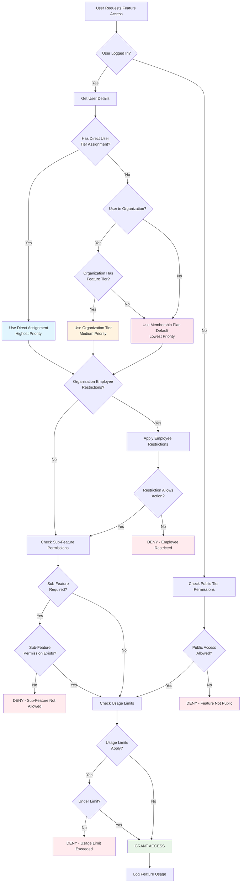
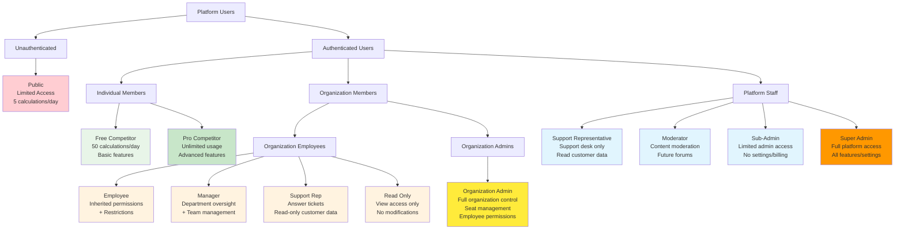
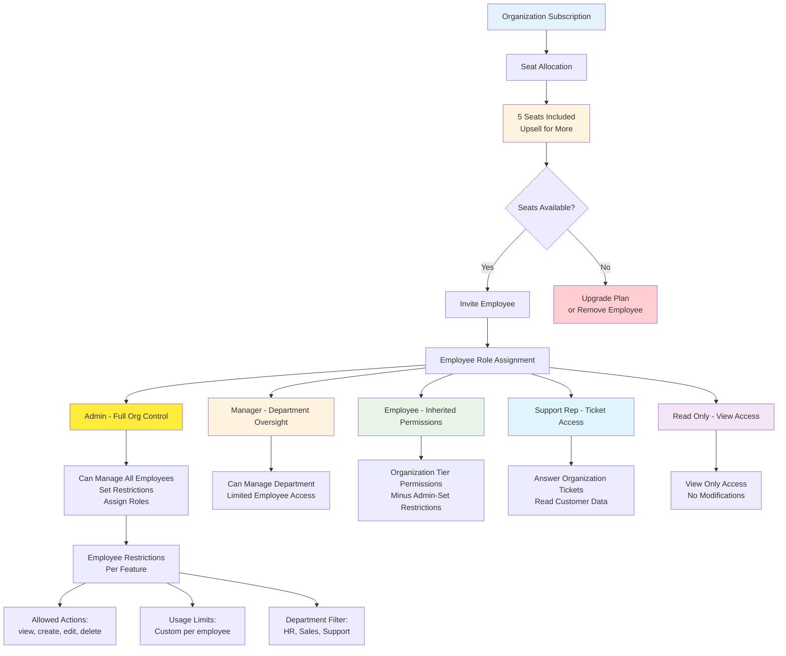
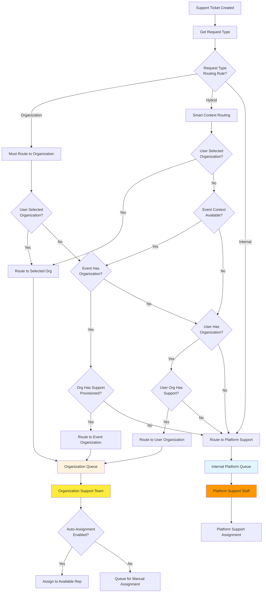
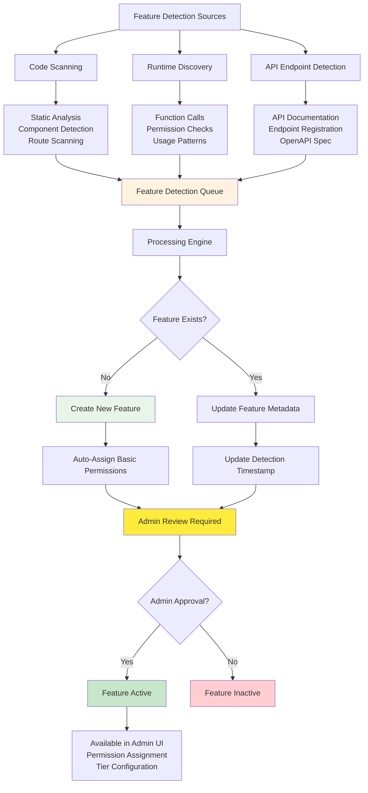

# Permission Hierarchy Architecture

## Permission Resolution Flow

## User Type Hierarchy

## Organization Seat Management

## Support Desk Routing Logic

## Dynamic Feature Detection

## Permission Priority System

1. **HIGHEST PRIORITY**: Direct User Tier Assignment
   - Explicitly assigned by admin
   - Overrides all other permissions
   - Can have expiration date

2. **MEDIUM PRIORITY**: Organization Tier Assignment
   - Set at organization level
   - Applies to all organization members
   - Affected by employee restrictions

3. **LOWEST PRIORITY**: Membership Plan Default
   - Based on user's membership type
   - Default fallback permissions
   - Standard tier assignments

## Employee Restriction Matrix

| Employee Role | Feature Access | Can Create | Can Modify | Admin Functions | Support Access |
|---------------|----------------|------------|------------|-----------------|----------------|
| **Admin** | Full Org Tier | Yes | Yes | Full | Organization Queue |
| **Manager** | Full Org Tier | Yes | Dept Only | Limited | Department Tickets |
| **Employee** | Restricted | Limited | Own Only | None | Create Tickets |
| **Support Rep** | Support Only | Tickets | Ticket Replies | None | Organization Queue |
| **Read Only** | View Only | No | No | None | View Tickets |

## Seat-Based Licensing

- **5 Seats Included** in base organization plans
- **Automatic Usage Tracking** via database triggers
- **Upsell Opportunities** when seats are full
- **Role-Based Seat Value** (Admin = 2 seats, Employee = 1 seat)
- **Seat Reclamation** when employees are deactivated